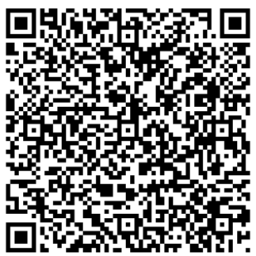
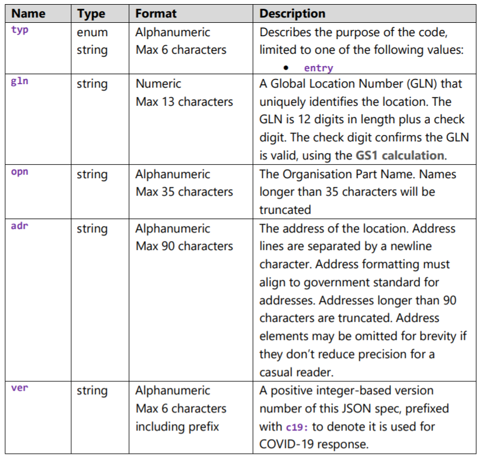

**Auteurs:** Robin GAUDIN, Lev POZNIAKOFF, Axel VALLON

**Date:** 19.12.2021

# SYM: Labo 3, Utilisation de données environnementales I

## Balises NFC

## Codes-barres

### 3.2 Questions

### 3.2.1

`Quelle est la quantité maximale de données pouvant être stockée sur un QR-code ? Veuillez expérimenter, avec le générateur conseillé5 de codes-barres (QR), de générer différentes tailles de QR-codes. Pensez-vous qu’il est envisageable d’utiliser confortablement des QRcodes complexes (par exemple du contenant >500 caractères de texte, une vCard très complète ou encore un certificat Covid)`

**Taille maximale**

La quantité maximale d'un code QR est limitée à un code de 177 de largeur sur 177 de hauteur. Cela correspond donc selon wikipedia aux capacité suivante pour la version 40 de QR-code (module)

- Caractères [numériques](https://fr.wikipedia.org/wiki/Nombre) : maximum 7 089
- Caractères [alphanumériques](https://fr.wikipedia.org/wiki/Alphanumérique) : maximum 4 296
- [Binaires](https://fr.wikipedia.org/wiki/Système_binaire) ([8-bits](https://fr.wikipedia.org/wiki/8-bits)) : maximum 2 953 [octets](https://fr.wikipedia.org/wiki/Octet)

Source https://fr.wikipedia.org/wiki/Code_QR

Donc on peut confortablement utiliser des code QR de plus de 500 caractère, peut importe l'encodage.

**vCard**

 Afin de générer un code de vCard, il est possible d'utiliser le générateur proposé par l'école et en remplissant le code, on arrive à un résultat similaire au suivant

Et on voit qu'il est tout a fait lisible sur l'application, sans complexité. Il faut cependant à faire attention à ce que les donnes inclues ne dépassent pas le nombre limite de caractère spécifique à l'encodage utilisé, sinon le code ne pourra pas être généré.

http://chart.apis.google.com/chart?cht=qr&chs=300x300&chl=BEGIN:VCARD%0AVERSION:2.1%0AN:Vallon;Axel%0AFN:Axel%20Vallon%0AORG:HEIG-VD%0ATITLE:Mr%0AADR:;;Route%20de%20Bellevue%2C%2031;Yverdon-les-Bains;Vaud;1400;Suisse%0ATEL;WORK;VOICE:00000000000%0AEMAIL;PREF;INTERNET:axel.vallon123%40heig-vd.ch%0AURL:%0ANOTE:%0AEND:VCARD&choe=UTF-8&chld=L

**Code QR**

Un code QR est composé d'un avec les éléments suivants

Source : https://www.health.govt.nz/system/files/documents/publications/covid-19_contact_tracing_qr_code_specification_25_may_2020.pdf

On peut via ces attribut deviner que la taille maximum d'un code QR ne permettra pas de dépasser la taille limite, et donc qu'un code QR arrive à implémenter sans problème les informations permettant d'authentifier un utilisateur avec son propre code QR. 

**Conclusion à la question**

Il est donc visible qu'il est donc très pratique d'utiliser ces code QR pour transmettre un payload d'information simple et structuré. Cependant, ce genre de passage d'information n'est pas optimal pour afficher directement une page web, ou des images. Il est mieux dans ce cas d'utiliser des code QR contenant une URL vers la ressource.

### 3.2.2

`Il existe de très nombreux services sur Internet permettant de générer des QR-codes dynamiques. Veuillez expliquer ce que sont les QR-codes dynamiques. Quels sont les avantages et respectivement les inconvénients à utiliser ceux-ci en comparaison avec des QR-codes statiques. Vous adapterez votre réponse à une utilisation depuis une plateforme mobile.`

Un code QR dynamique ont une URL courte intégrée dans le code, et permettent de rediriger vers une autre URL en passant souvent par un intermédiaire. 

**Exemple URL Dynamique**

`https://qrco.de/qrcgFTW`

**Exemple URL Statique**

`https://help.qr-code-generator.com/fr/articles/3175300-quelle-est-la-difference-entre-les-codes-statiques-et-dynamiques`

#### Avantage et désavantage

**Avantages** 

- Comme la ressource cible peut être modifiée, on peut changer de ressource cible sans changer de code QR.
- Comme le code QR est plus petit, le temps d'analyse du code et moins petit et énergie utilisée est donc moins grande et adaptée au mobile. Et de manière liée, comme le code QR est plus petit, il est moins lourd à envoyer sur un mobile, et on a donc les même avantage que pour le scan allégé.
- Il est possible de savoir combien de personne ont utilisé de code QR, car on passe via une API.

**Désavantage**

- Un utilisateur est obligé d'avoir accès à internet pour accéder à la ressource.
- On passe par un intermédiaire (normalement), donc on est dépendant de la sécurité mise en place par celui-ci.
- Pas approprié à des contenu statique et léger.

## Balises iBeacon

### 4.1 Manipulation

Pour l'implémentation des balises iBeacon, nous avons créé 2 activités, l'une principale avec une RecyclerView, dont les éléments ajoutés sont la 2ème activité qui est utilisée comme fragment pour afficher les données des iBeacons détectés.

Nous avons utilisé la librairie proposée (AltBeacon), et pour comprendre son fonctionnement nous avons simplement téléchargé et essayé leur application de base. Ceci nous a permis d'analyser quelles méthodes nous avions besoin pour la réalisation demandée.

### 4.2 Question

Les iBeacons sont très souvent présentés comme une alternative à NFC. Vous commenterez cette
affirmation en vous basant sur 2-3 exemples de cas d’utilisations (use-cases) concrets (par exemple e-
paiement, second facteur d’identification, accéder aux horaires à un arrêt de bus, etc.).

Les iBeacons ont une utilisation différente du NFC, ils permettent de diffuser des informations à plusieurs personnes en même temps, et ont une portée bien plus grande (jusqu'à 100m pour les iBeacon, vs 20cm pour le NFC).

Cas d'utilisation:

1. Stades de baseball

   Aux Etats-Unis, la ligue de baseball américaine utilise cette technologie à proximité des stades pour transmettre des données pratiques aux utilisateurs, tels que les prochains matchs de l'équipe, des vidéos highlights des derniers matchs, etc. Mais aussi aux portes du stade, en affichant le billet électronique de la personne automatiquement, ou pour indiquer le chemin à suivre pour se rendre à sa place. Il y a aussi une détection des visites répétées pour transmettre des promotions et remises.

2. Coachella

   L'un des plus grands festivals au monde a integré cette technologie afin d'indiquer aux utilisateurs là où ils se trouvent et sur la programmation du festival. On retrouve également une indication de l'affluence à certains points,ou tout comme pour les stades de baseball, une carte de fidelité électronique est utilisée, pour voir le nombre de visites des utilisateurs à certains endroits et offrir un cocktail à la 10ème visite.

3. Mingleton

   Même cette application de rencontre utilise les iBeacon, afin de rentrer en contact avec une personne à proximité. Dans le cas d'un interêt mutuel, les deux personnes pourront obtenir des informations sur l'autre (amis en commun, informations diverses).

Sources :

https://fr.slideshare.net/christopherobinet/balises-ibeacon-26-cas-concrets-dutilisation

https://www.natural-solutions.eu/blog/ibeacon-vs-rfid-vs-nfc-vs-gps#:~:text=%C2%B7%20NFC%20a%20une%20plage%20de,peut%20transmettre%20jusqu'à20300m.
